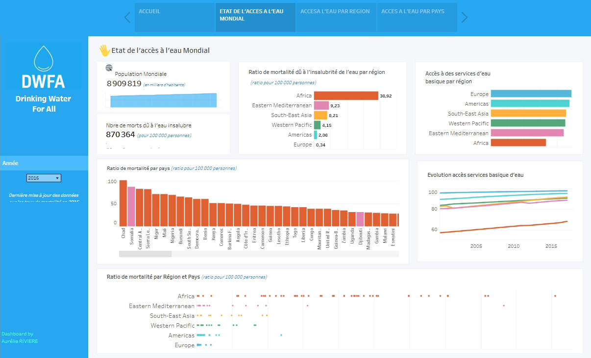
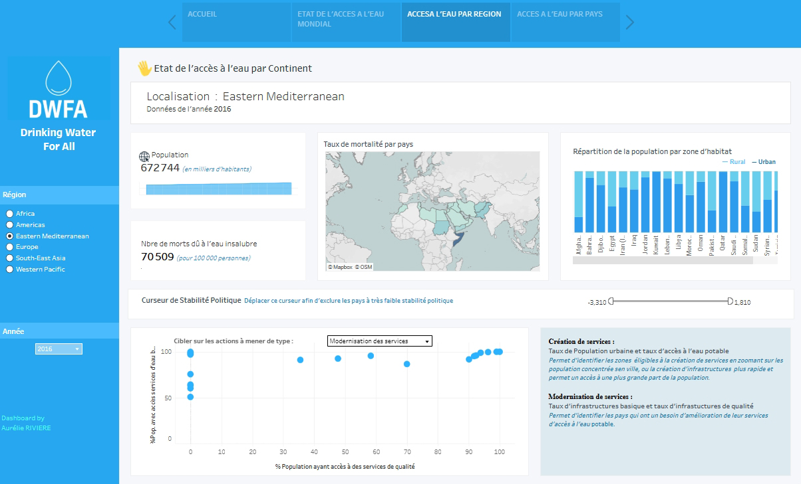
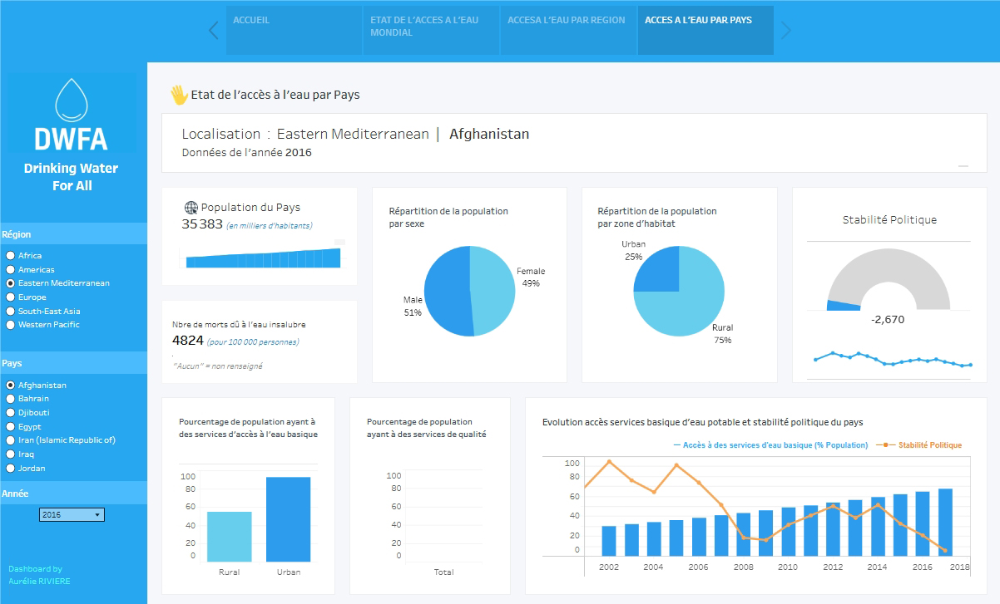

# Projet 10 : Tableau de bord de la gestion de l'accès à l'eau potable

 

## 🎬 Scénario  
Dans le cadre d’une mission pour une ONG internationale, vous êtes chargée d’analyser les données de l’ONU sur l’accès à l’eau potable dans le monde et de concevoir un tableau de bord clair et interactif pour les décideurs, afin de les aider dans leur sélection des pays prioritaires. 

 

## 🎯 Objectifs  

- Nettoyer et structurer les données provenant de plusieurs fichiers  
- Concevoir un tableau de bord interactif sous Tableau Software  
- Permettre une analyse multi-niveaux : monde, région, pays  
- Mettre en évidence les indicateurs clés sur l’évolution de l’accès à l’eau 

 

## 🛠 Outils utilisés  
- Excel
- Tableau Software 

 

## 📈 Étapes du projet  
- Préparation et structuration des données
- Proposition d'un mockup de dashboard
- Création d'un modèle relationnel
- Définition des KPIs et axes d’analyse
- Conception du dashboard sous Tableau  

 

## 📊 Visualisations du tableau de bord  

  
    
    

