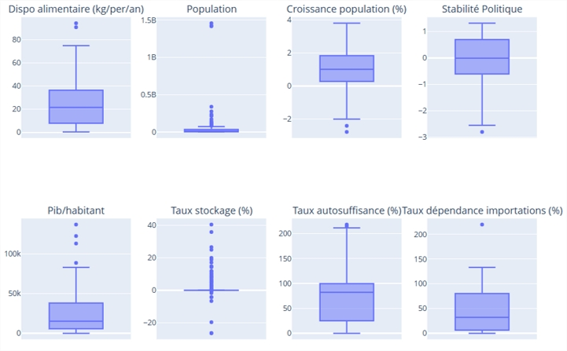
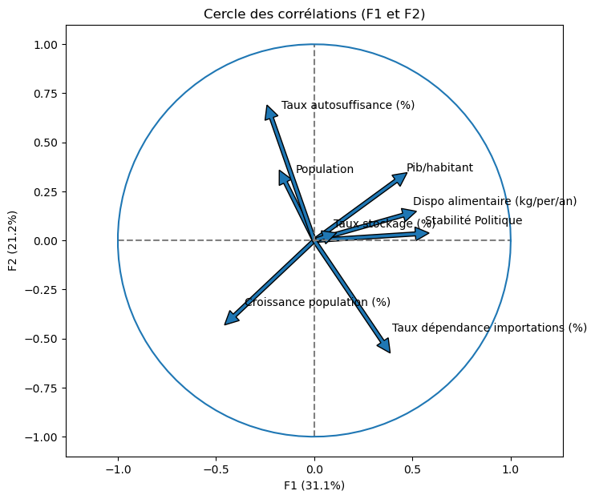
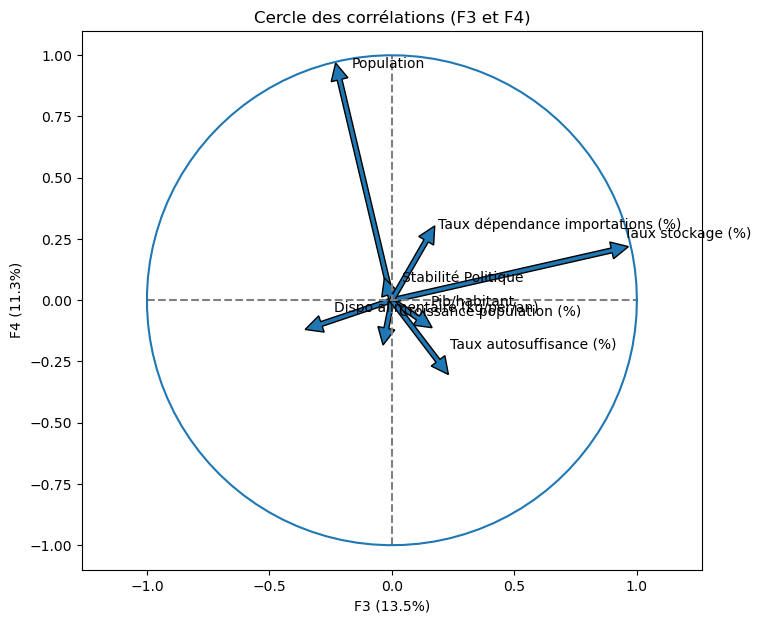
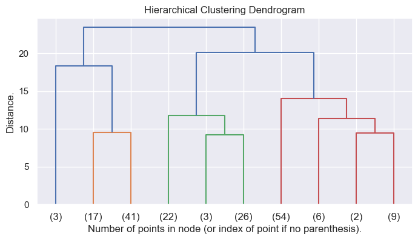
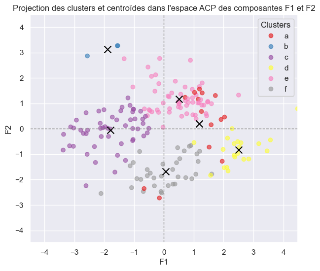
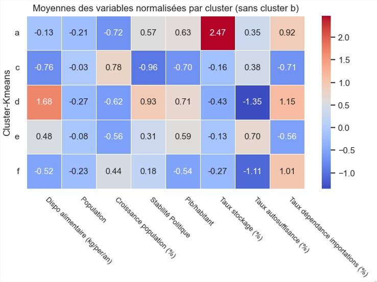

# Projet 11 : Etude et segmentation de marchés

 

## 🎬 Scénario  

Vous êtes Data Analyst chez **La poule qui chante**, entreprise française spécialisée dans l’élevage et la vente de poulets bio. Dans une perspective de développement international, le PDG vous confie une mission stratégique : identifier des groupes de pays pertinents pour l’exportation, à partir de données mondiales.

 

## 🎯 Objectifs  

- Collecter, nettoyer et croiser des données open data issues de la FAO, de la Banque Mondiale et d’autres sources fiables  
- Sélectionner au moins 8 variables pertinentes selon l’analyse PESTEL  
- Couvrir un échantillon représentatif de plus de 100 pays  
- Réduire la dimensionnalité via ACP et identifier des clusters homogènes de pays via CAH et K-means  
- Proposer des recommandations de zones géographiques prioritaires au COMEX

 

## 🛠 Outils utilisés  
- Python
- Pandas, Seaborn, Matpotlib, Scikit-learn
- CAH, Kmeans, ACP

 

## 📈 Étapes du projet  

### 1. Collecte & préparation des données  
- Données issues de la FAO, Banque mondiale, donnéesmondiales.com  
- Sélection selon des critères PESTEL : démographie, agriculture, politique, économie, logistique…  
- Normalisation et regroupement dans un seul jeu de données
- Création de variables complémentaires par feature engineering

### 2. Analyse exploratoire  
- Étude des corrélations et distributions  
- Suppression ou imputation des valeurs manquantes

### 3. Réduction de dimension via ACP  
- Interprétation des axes principaux  
- Projection des pays dans l’espace réduit

### 4. Clustering  
- Classification Ascendante Hiérarchique (CAH)

- Validation du nombre optimal de clusters  
- Application de K-means et visualisation des groupes de pays

- Analyse des clusters

- Création d'un score de pertinence pour sélectionner les pays les plus pertinents

## ✅ Résultat  
Une segmentation géographique claire de 4 groupes de pays, appuyée par des indicateurs socio-économiques, pour orienter la stratégie d’exportation de l’entreprise vers les zones les plus favorables.
