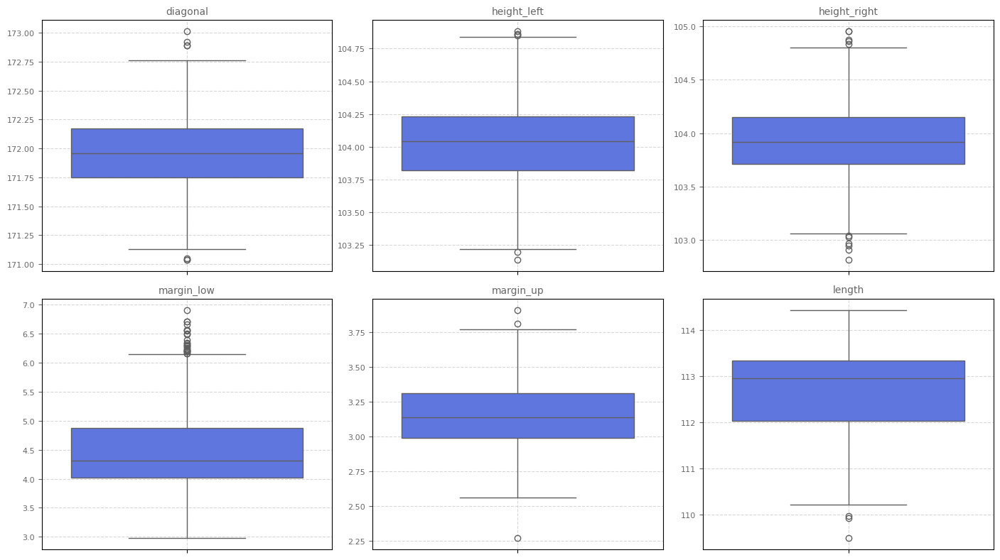
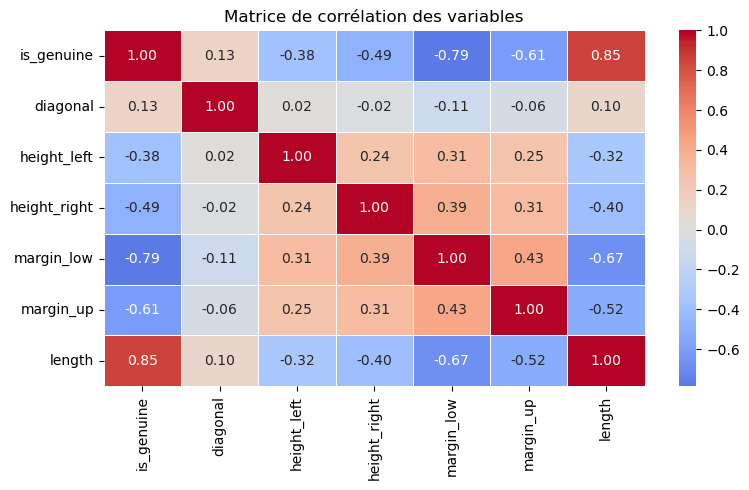
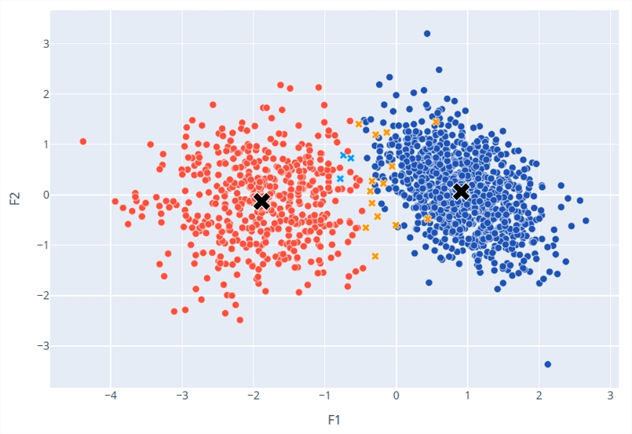
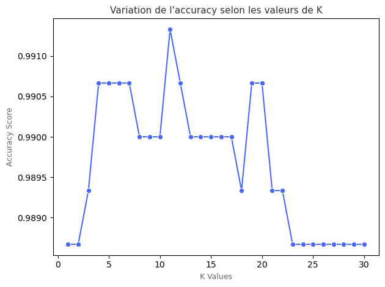
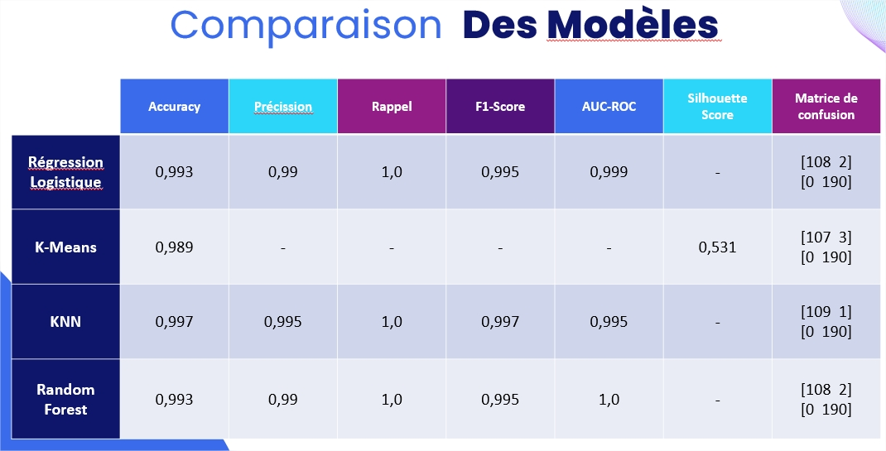
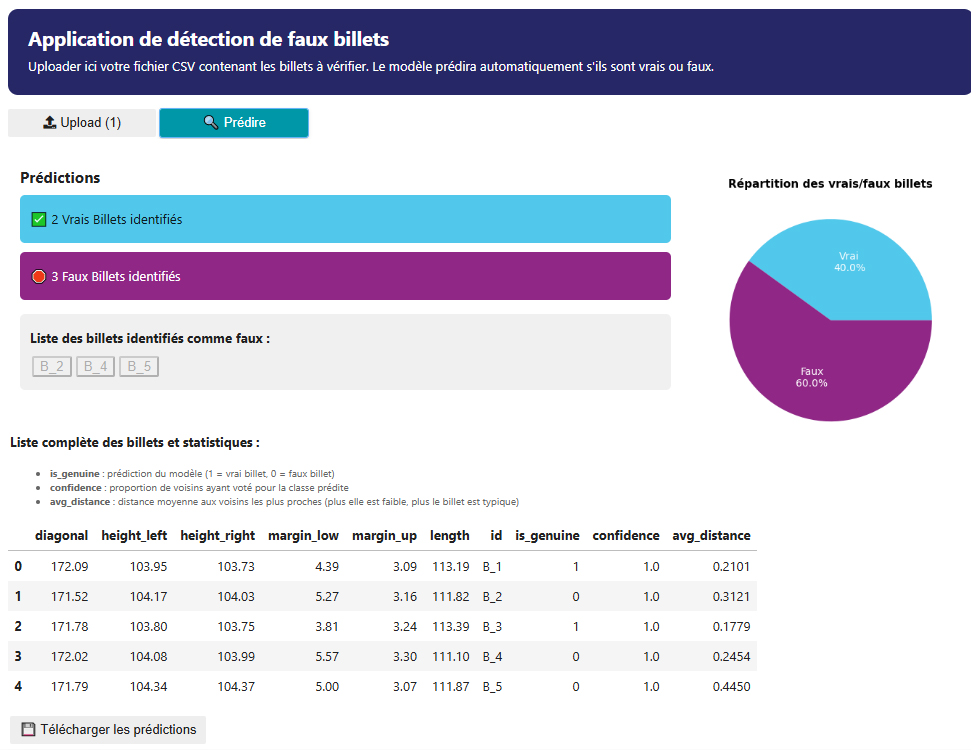

# Projet 12 : Application de détection de faux billets

 

## 🎬 Scénario  
Dans le cadre d’une mission de Data Analyst pour l'ONCFM (Organisation nationale de lutte contre le faux-monnayage), vous êtes chargé d’évaluer différents modèles de machine learning pour détecter automatiquement les faux billets à partir de leurs caractéristiques physiques.

 

## 🎯 Objectifs  

- Analyser le jeu de données ainsi que les caractéritiques géométriques des billets et le préparer pour leur utilsiation dans des modèles 
- Tester plusieurs algorithmes de classification supervisée et non supervisée  
- Comparer leurs performances à l’aide de métriques adaptées  
- Créer une interface interactive pour exploiter le modèle final

 

## 🛠 Outils utilisés  
- Python 
- Jupyter Notebook
- Pandas, Matplotlib, Seaborn
- SciPy, scikit-learn et statsmodels

 

## 📈 Étapes du projet  
- Chargement et exploration des données  
- Visualisation et compréhension des variables

<em>Analyses des variables et des distributions</em> 

- Réalisation d'une régression linéaire pour combler les valeurs manquantes
- Sélection des variables prédictives

- Réalisation d'une régression logistique
- Modélisation non supervisée : K-means

<em>Projections des clusters Kmeans via ACP</em> 

- Modélisation KNN

- Modélisation Random Forest
- Optimisation par GridSearchCV
- Évaluation des performances (accuracy, AUC, courbe ROC)  
- Comparaison des modèles

- Exportation du modèle sélectionné (KNN)
- Création d'une interface interactive pour tester de nouveaux billets

