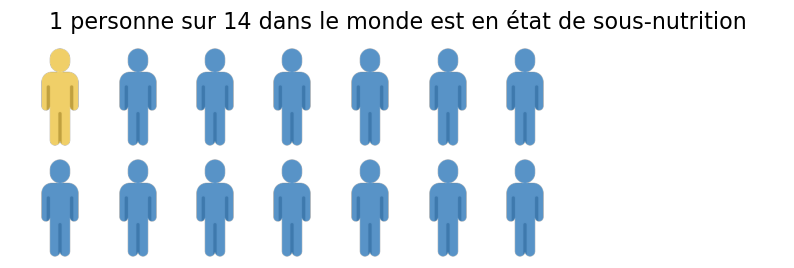
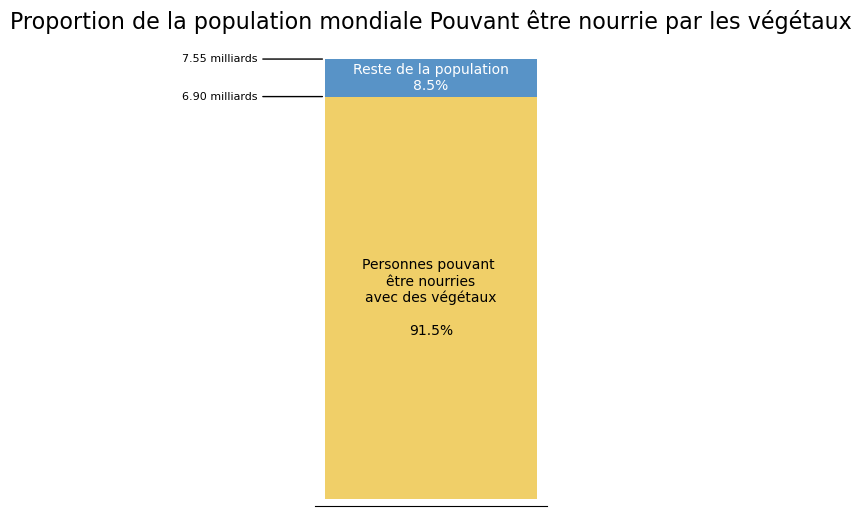
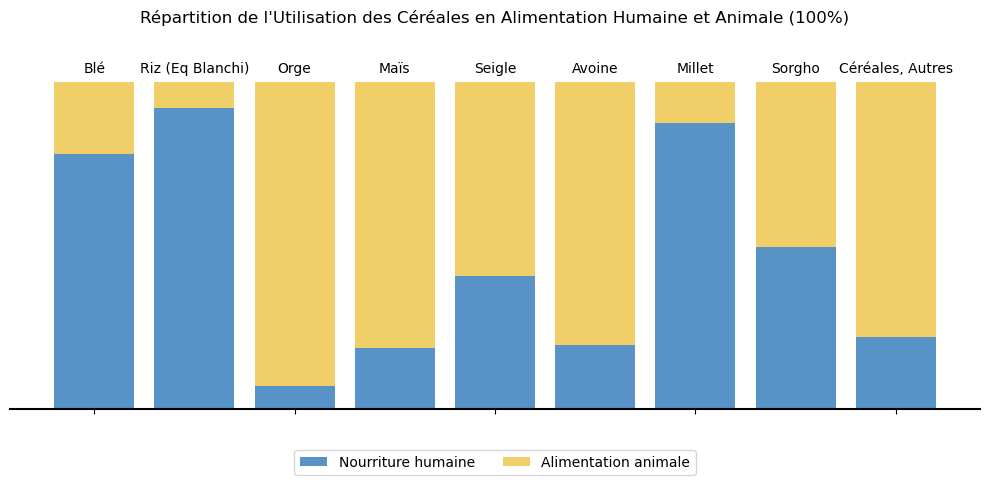
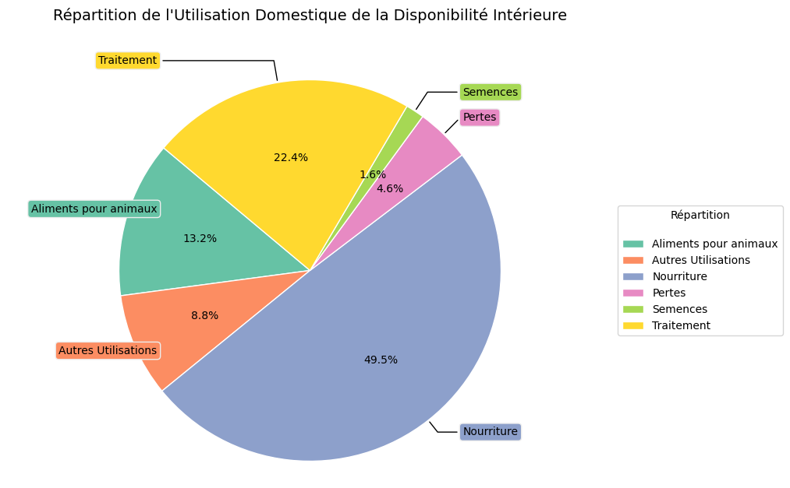
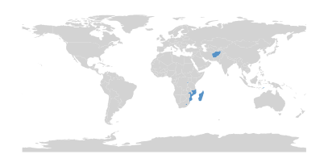
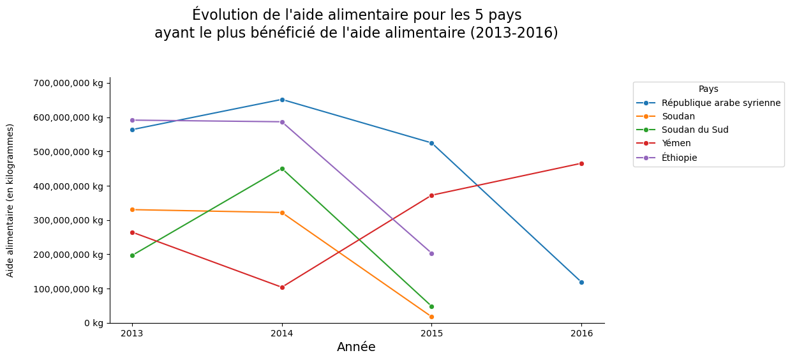
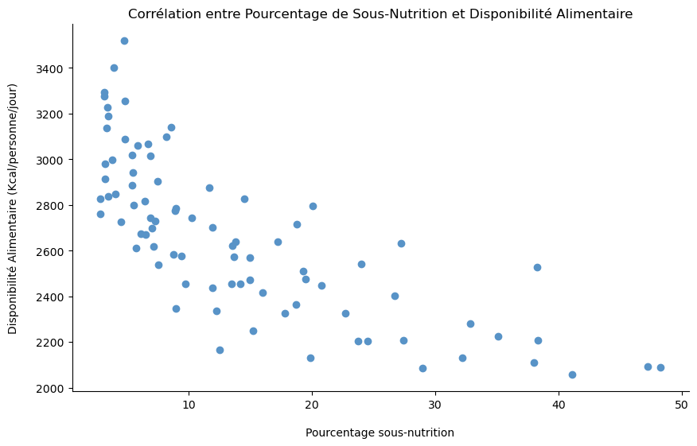

# Projet 4 : Etude sur la sous alimentation dans le monde

 

## 🎬 Scénario  
Vous rejoignez l’équipe de recherche de la FAO (Organisation des Nations Unies pour l’Alimentation et l’Agriculture) en tant que Data Analyst. Votre mission : exploiter les données historiques de 2013 à 2017 sur la sous-nutrition dans le monde afin de produire des analyses pour un grand rapport de santé publique. 

 

## 🎯 Objectifs  

- Nettoyer, structurer et analyser les données historiques de la FAO  
- Identifier les régions les plus touchées par la sous-alimentation  
- Mettre en lumière les évolutions temporelles et écarts géographiques  
- Fournir des visualisations claires et informatives

 

## 🛠 Outils utilisés  
- Python, Jupyter Notebook
- Pandas, Matplotlib, Seaborn
- Open Data FAO

 

## 📈 Étapes du projet  
- Intégration de plusieurs jeux de données FAO (2013-2017)  
- Dictionnaire des données et exploration des variables  
- Nettoyage et traitement des données
- Analyse exploratoire  
- Taux de sous-alimentation par pays, continent et année  
- Comparaison des indicateurs nutritionnels par zone géographique  
- Mise en lumière des zones critiques à travers des graphiques  
- Création de visualisations 

 

## 📊 Représentations visuelles  
  

