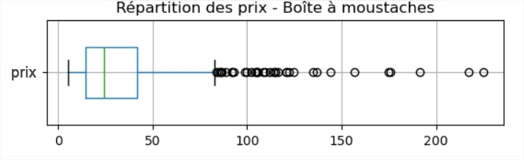
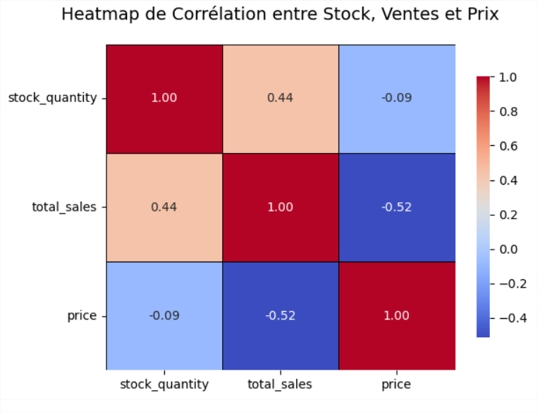

# Projet 6 : Gestion et analyse de données site e-commerce

 

## 🎬 Scénario  
Vous rejoignez l’entreprise *Bottleneck*, un marchand de vin haut de gamme, en tant que Data Analyst. Leur gestion artisanale des données pose des problèmes de cohérence et d’analyse. Vous êtes chargé de fiabiliser les bases de données produits/ventes et de produire des analyses stratégiques pour le CODIR. 

 

## 🎯 Objectifs  

- Nettoyer et fusionner plusieurs fichiers issus de systèmes hétérogènes (ERP et site web)  
- Identifier et corriger les incohérences de saisie  
- Réaliser une analyse descriptive et stratégique des ventes et du stock  
- Identifier les erreurs de prix, les valeurs aberrantes et les corrélations pertinentes

 

## 🛠 Outils utilisés  
- Python, Jupyter Notebook
- Pandas, Matplotlib, Seaborn
- Scipy

 

## 📈 Étapes du projet  

### 1. Nettoyage et préparation des données  
- Jointure des fichiers via une table de correspondance manuelle  
- Identification et correction de 8 erreurs types (typographie, types, doublons, format, etc.)  
- Normalisation des données pour les futures analyses  

### 2. Analyse descriptive et stratégique  
- Calcul du chiffre d’affaires total et par produit  
- Identification du top 20% générant 80% des ventes (loi de Pareto)  
- Analyse des stocks, marges, rotation et mois de couverture  
- Visualisation des distributions de prix, analyse des outliers via boxplot  

### 3. Analyse statistique  
- Détection des valeurs aberrantes avec Z-score et écart interquartile  
- Étude de corrélations entre variables quantitatives (prix, stock, CA, marges)  
- Interprétation des coefficients de corrélation et mise en évidence des liens significatifs

