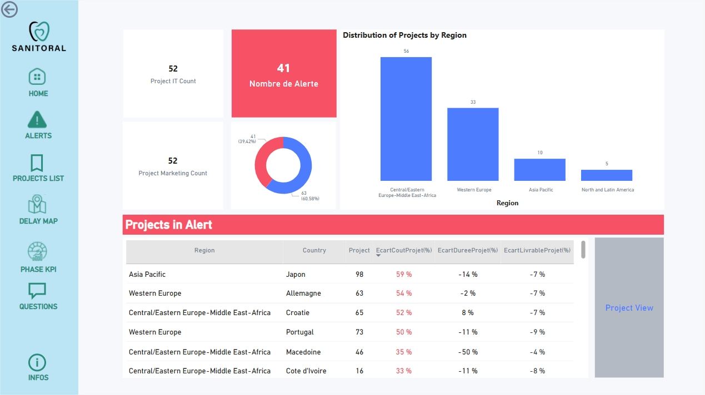
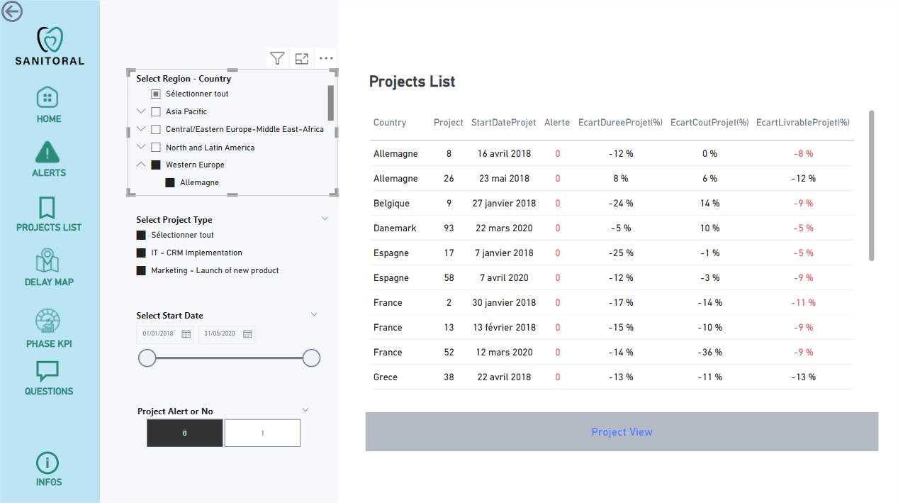
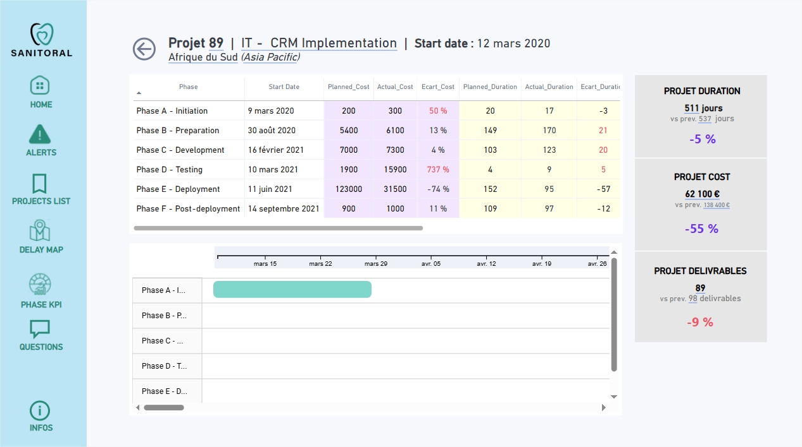

# Projet 7 : Tableau de bord de gestion de projets

 

## 🎬 Scénario  
En tant que Data Analyst en mission chez Sanitoral, une entreprise internationale spécialisée en soins bucco-dentaires, vous êtes chargé de concevoir un tableau de bord dynamique dans Power BI pour suivre l’avancement des projets stratégiques à l’échelle mondiale.
 

 

## 🎯 Objectifs  

- Comprendre les besoins des utilisateurs à travers un Product Strategy Canvas  
- Nettoyer, modéliser et relier des données multi-sources avec Power Query  
- Construire un tableau de bord lisible, interactif et actualisable  
- Proposer des visualisations pertinentes pour piloter retards, coûts et livrables  
- Intégrer des fonctionnalités avancées : filtres dynamiques, rôles, DAX

 

## 🛠 Outils utilisés  
- Power Query
- Power BI
- Dax

 

## 📈 Étapes du projet  

### 1. Cadrage fonctionnel  
- Rédaction du Product Strategy Canvas pour formaliser les user stories  
- Création d’un mockup pour guider la conception visuelle  

### 2. Préparation et modélisation des données  
- Intégration des données extraites du logiciel de gestion de projets  
- Nettoyage automatique dans Power Query Editor  
- Création de clés uniques via colonnes calculées  
- Modélisation des relations entre les tables

### 3. Conception du tableau de bord  
- Création de pages dédiées avec indicateurs retards, coûts, livrables  
- Visualisations dynamiques adaptées aux différents niveaux hiérarchiques 
- Calculs d’indicateurs clés (écarts planifié/réel, avancement, budget) via DAX  

 

## ✅ Résultat et Visualisations du tableau de bord  
Un outil interactif, clair et réutilisable, facilitant le suivi des projets dans une logique de pilotage stratégique par la donnée.

