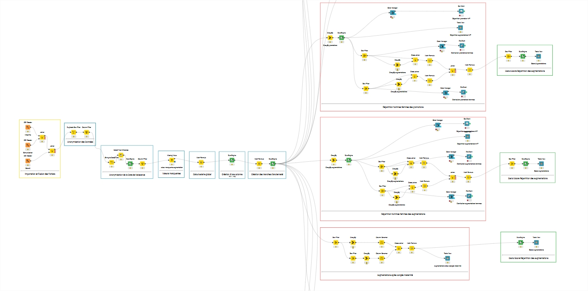
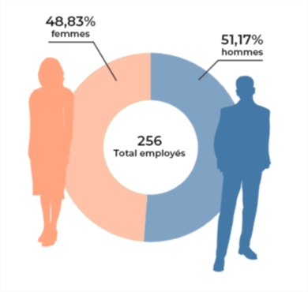
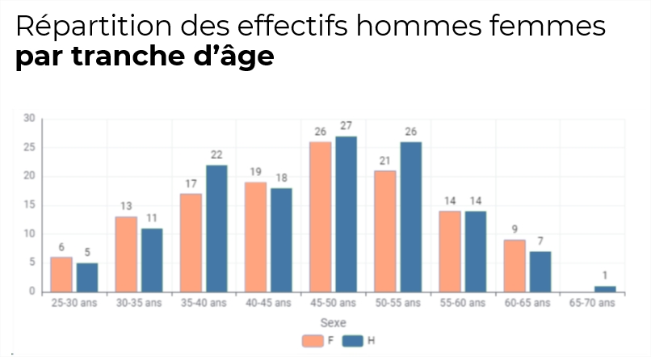
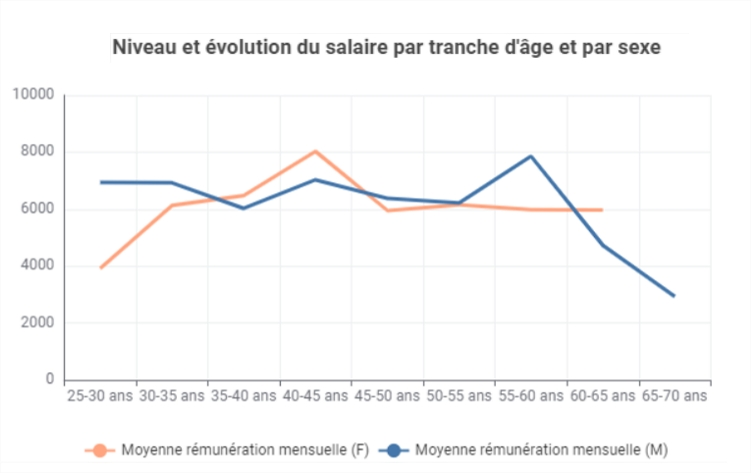

# Projet 8 : Rapport sur l'égalité femmes-hommes en entreprise

 

## 🎬 Scénario  
Vous êtes Data Analyst dans un cabinet de conseil en transformation digitale. La DRH vous confie une mission cruciale : automatiser la création du rapport sur l’égalité professionnelle femmes-hommes, à publier annuellement selon la législation en vigueur. 

 

## 🎯 Objectifs  

- Automatiser le calcul et la visualisation des indicateurs clés de l’égalité F/H à l’aide de KNIME  
- Garantir la conformité RGPD des données issues du SIRH  
- Générer un fichier .csv exploitable 
- Préparer une présentation claire pour diffusion en plénière  
- Fournir un score final accompagné de recommandations concrètes

 

## 🛠 Outils utilisés  
- Knime
- ETL

 

## 📈 Étapes du projet   
- Collecte & anonymisation des données
- Sélection de 5 indicateurs pertinents parmi ceux du Ministère du Travail
- Conception du workflow dans KNIME  
- Calcul automatisé des indicateurs
- Génération des graphiques pour chaque indicateur
- Export structuré csv et prêt à l’usage pour analyses futures  
- Calcul du Score final obtenu 

 

## 📊 Schéma d'automatisation Knime

 

## 📊 Exemples d'indicateurs crées

