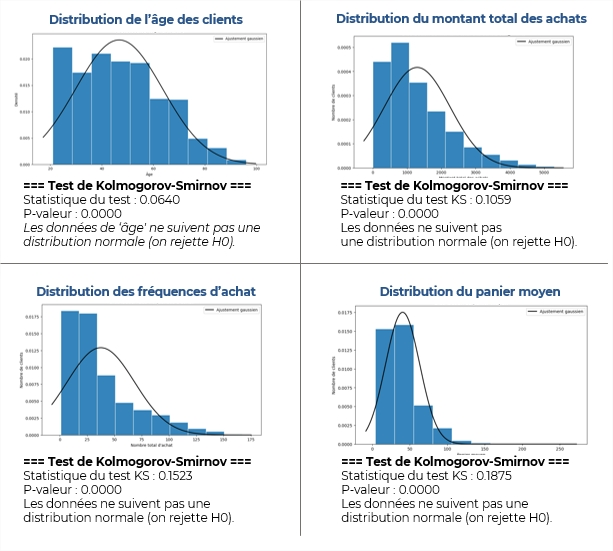
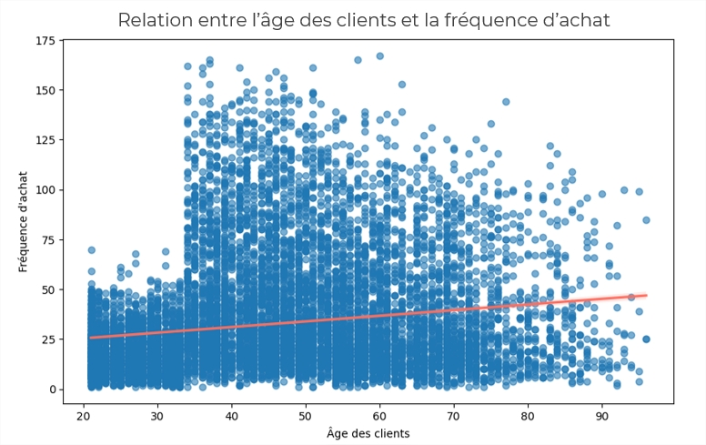
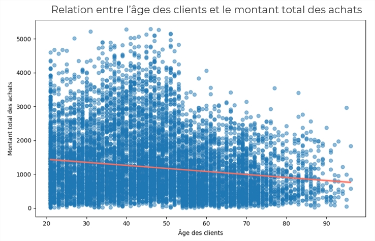
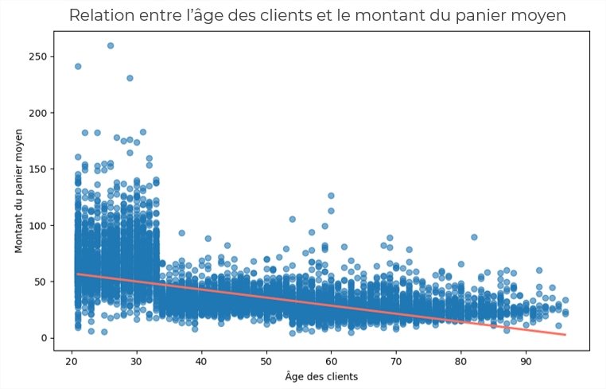
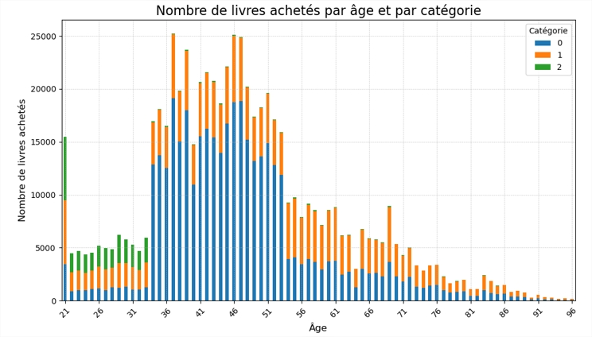

# Projet 9 : Analyse des ventes d'une librairie et analyses statistiques

 

## 🎬 Scénario  
Vous êtes recruté(e) comme Data Analyst par Lapage, une librairie ayant récemment développé un site de vente en ligne. L’objectif est de faire un bilan complet de l’activité en ligne à partir de la base de données des transactions, pour alimenter la stratégie commerciale. 

 

## 🎯 Objectifs  

- Analyser les indicateurs clés de vente par type de produit, période et support  
- Étudier le comportement des clients (âge, sexe, catégories d’achat)  
- Identifier les corrélations entre variables, via des tests statistiques  
- Élaborer des recommandations stratégiques basées sur l’analyse des données 

 

## 🛠 Outils utilisés  
- Python, Jupyter Notebook
- Pandas, Matplotlib, Seaborn, SciPy, statsmodels
- **Méthodes statistiques** : test de normalité, corrélation de Spearman, corrélation de Pearson, Levene, Khi2  

 

## 📈 Étapes du projet  

### 1. Préparation et exploration des données  
- Analyse exploratoire des fichiers de données : clients, produits, transactions  
- Nettoyage, structuration et enrichissement des données  
- Segmentation des clients (B2B / B2C)

### 2. Analyse des ventes et des performances  
- Calcul du chiffre d'affaires global et par catégorie de produits  
- Analyse temporelle : Lissage du CA par moyenne mobile, détection de la saisonnalité  
- Analyse des performances produits : top références, loi de Pareto (20/80)

### 3. Études statistiques et corrélations  
  - Test de normalité des variables → Kolmogorov-Smirnov  
  - Homogénéité des variances → Test de Levene
  - Lien entre le genre des clients et les catégories de livres achetés → Test du Khi² (Variables qualitatives)
  - Corrélation entre âge et montant total des achats → Corrélation de Spearman (Variables quantitatives)  
  - Corrélation entre âge et fréquence d’achat  
  - Lien entre âge des clients et catégories de livres achetés → Test de Kruskal-Wallis  

 

## 📊 Extraits d’analyses  

